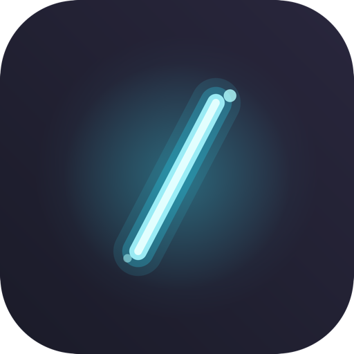
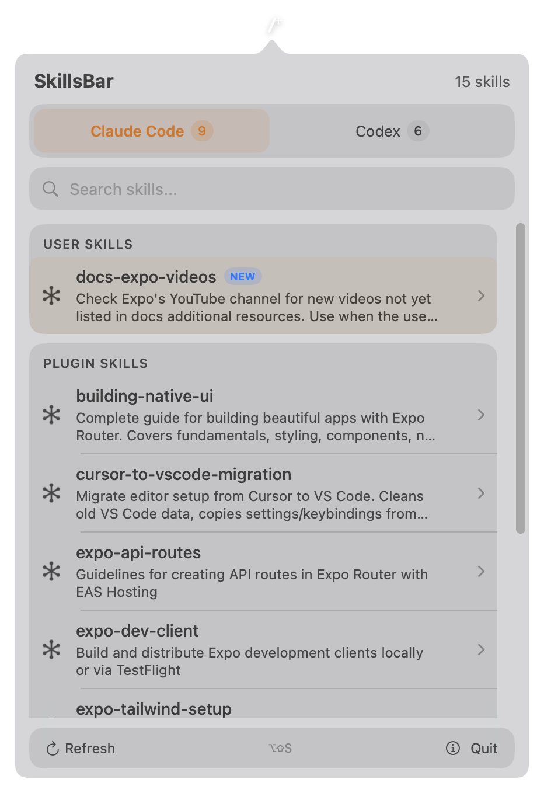
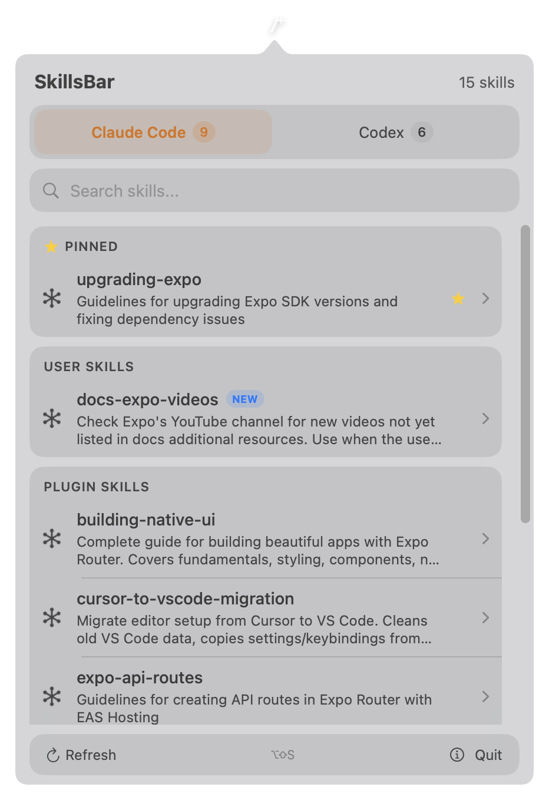
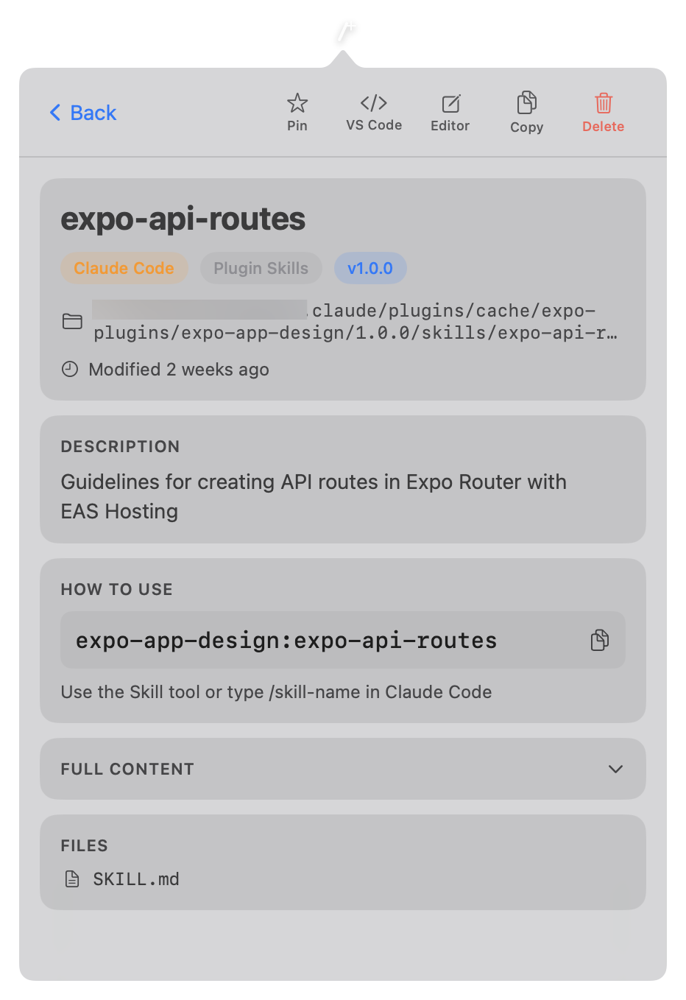

<p align="center">
  
</p>

<h1 align="center">SkillsBar</h1>

<p align="center">
  A native macOS menu bar app for browsing and managing your <a href="https://docs.anthropic.com/en/docs/claude-code">Claude Code</a> and <a href="https://github.com/openai/codex">Codex CLI</a> skills.
</p>

## Screenshots

<p align="center">
  
  &nbsp;&nbsp;
  
  &nbsp;&nbsp;
  
</p>

## Features

- **Tabbed browsing** - separate tabs for Claude Code and Codex skills with count badges
- **Search** - filter skills by name or description
- **Pin favorites** - pin frequently used skills to the top of each tab (persisted across restarts)
- **"New" indicator** - skills modified in the last 24 hours are marked with a blue badge
- **Detail view** - metadata badges, description, trigger command with copy button, file listing
- **Full content preview** - expandable section to view the raw SKILL.md body
- **Quick actions** - open in VS Code, open in default editor, copy path, reveal in Finder, delete
- **Right-click context menu** - pin, open, copy, delete directly from the list
- **Global hotkey** - toggle the popover from anywhere with `Option + Shift + S`
- **Live updates** - FSEvents directory watcher auto-refreshes when skills are added or removed
- **No dock icon** - lives entirely in the menu bar

## Watched Directories

| Path | Source |
|------|--------|
| `~/.claude/skills/` | Claude Code user skills |
| `~/.claude/plugins/cache/` | Claude Code plugin skills |
| `~/.codex/skills/` | Codex CLI built-in and user skills |

## Install

1. Download `SkillsBar-vX.X.X.zip` from the [latest release](https://github.com/amandeepmittal/skillsbar/releases/latest)
2. Unzip and move `SkillsBar.app` to your Applications folder
3. Right-click the app and select **Open** on first launch (required for unsigned builds)

## Requirements

- macOS 14 (Sonoma) or later
- Xcode 15+ (to build from source)

## Build from Source

```bash
git clone https://github.com/amandeepmittal/skillsbar.git
cd skillsbar
xcodebuild -scheme SkillsBar -configuration Release build
```

Or open `SkillsBar.xcodeproj` in Xcode and hit Run.

## Tech Stack

- Swift 5.9, SwiftUI
- `NSStatusItem` + `NSPopover` for menu bar integration
- `FSEventStream` (CoreServices) for live directory watching
- Carbon `RegisterEventHotKey` for global keyboard shortcut
- Regex-based YAML frontmatter parser (no third-party dependencies)

## License

MIT

## Author

[Aman Mittal](https://amanhimself.dev)
