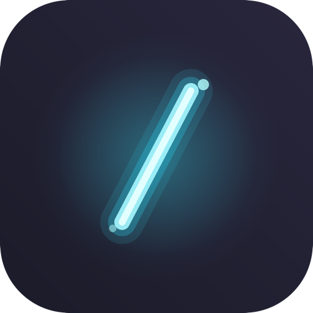
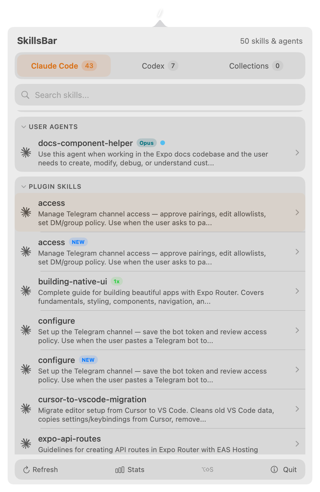
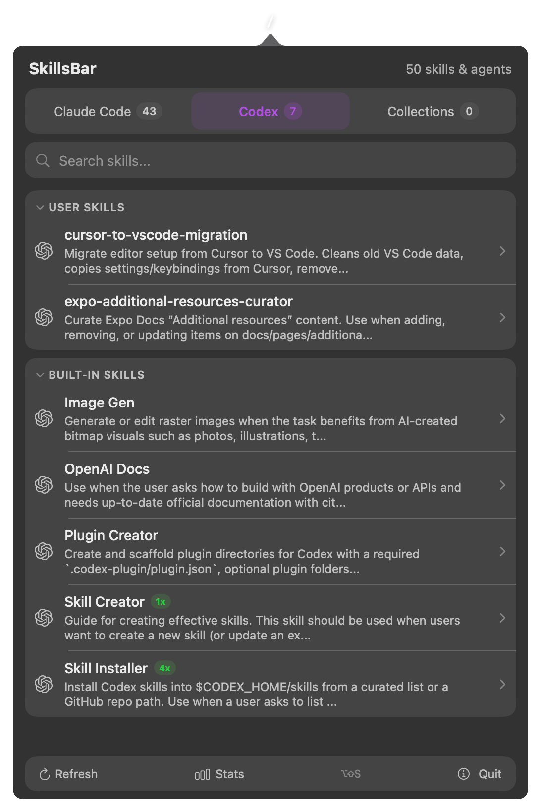
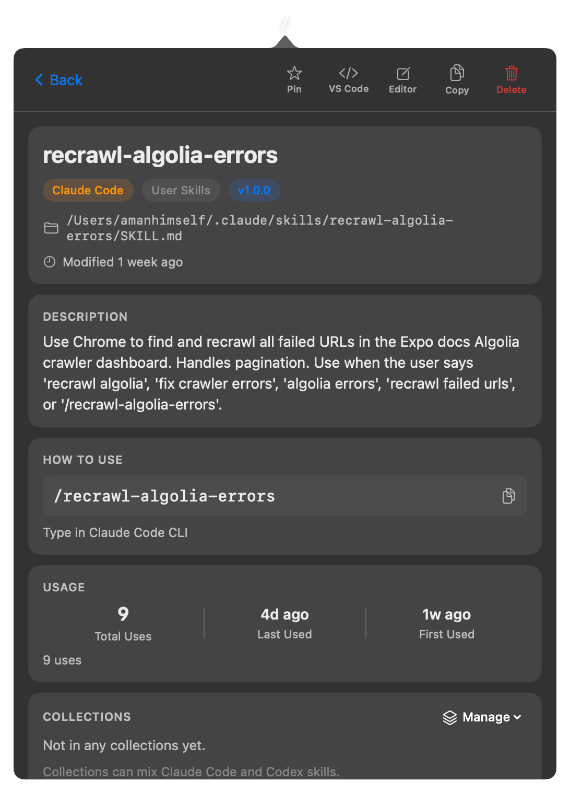
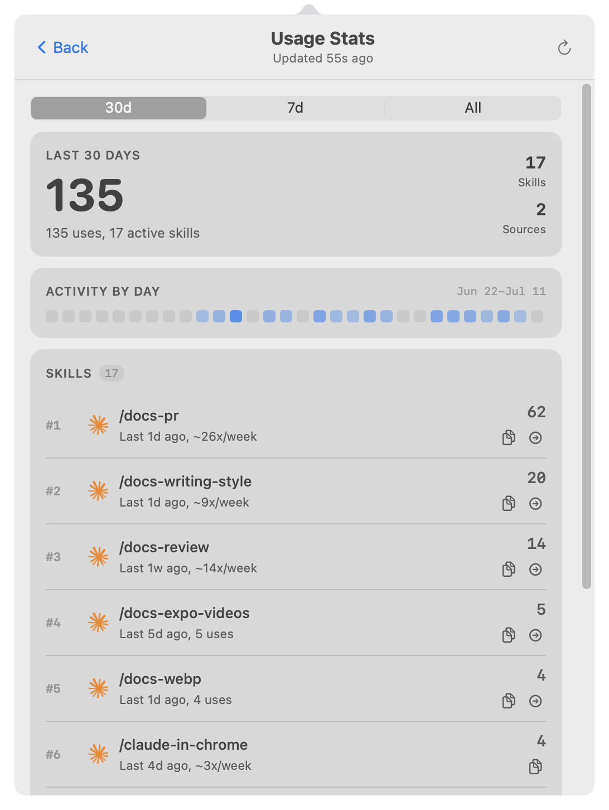
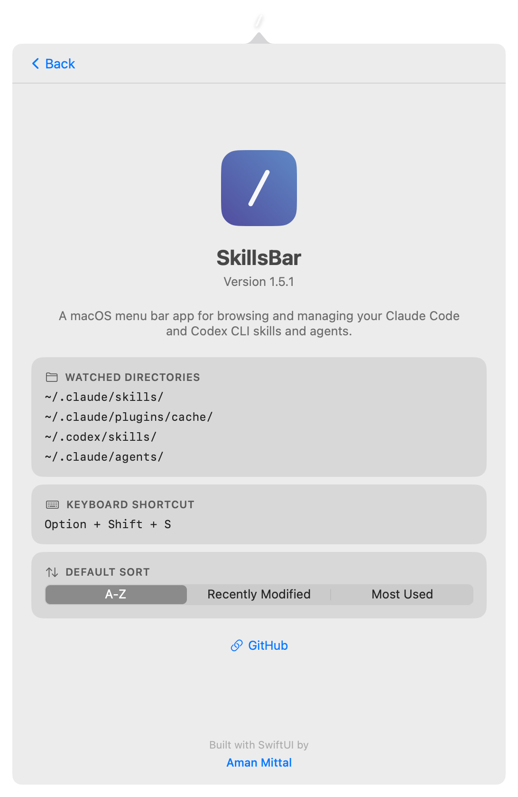
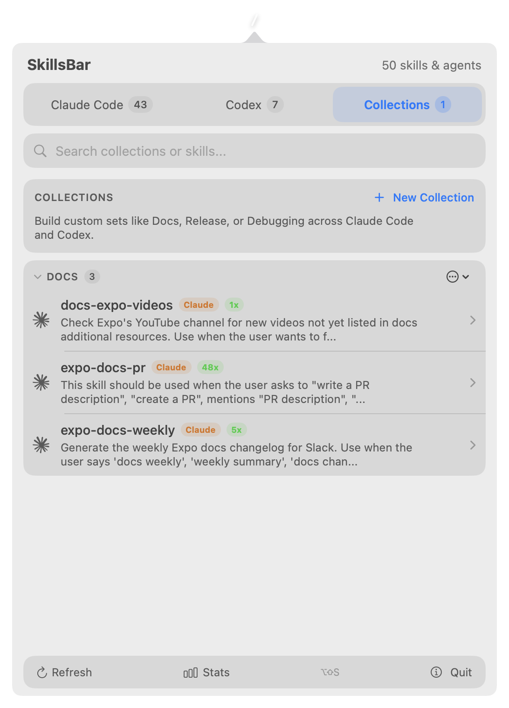
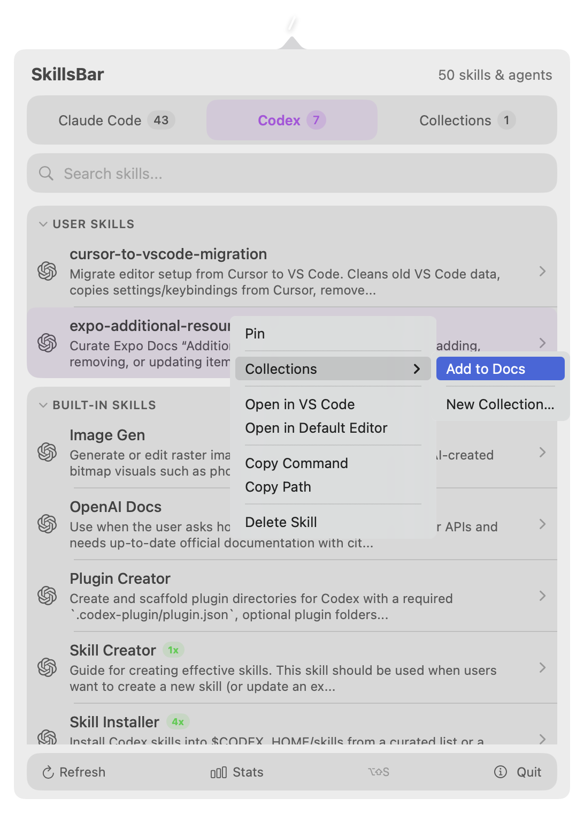
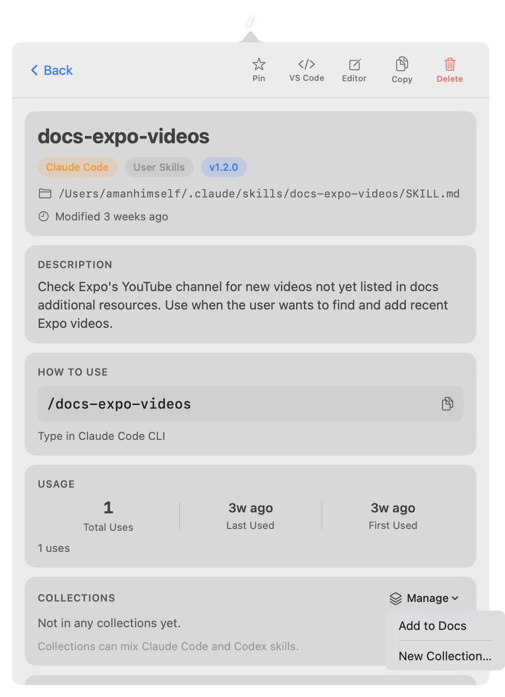

<p align="center">
  
</p>

<h1 align="center">SkillsBar</h1>

<p align="center">
  A macOS menu bar app for browsing and managing your <a href="https://docs.anthropic.com/en/docs/claude-code">Claude Code</a> and <a href="https://github.com/openai/codex">Codex CLI</a> skills, collections, and agents.
</p>

<p align="center">
  
</p>

## Screenshots

<p align="center">
  
  &nbsp;&nbsp;
  
  &nbsp;&nbsp;
  
  &nbsp;&nbsp;
  
  &nbsp;&nbsp;
  
  &nbsp;&nbsp;
  
  &nbsp;&nbsp;
  
  &nbsp;&nbsp;
  
</p>

## Features

- **Tabbed browsing** - separate tabs for Claude Code, Codex, and Collections with count badges
- **Search** - filter skills and collections by name, description, or trigger
- **Pin favorites** - pin frequently used skills to the top of each tab (persisted across restarts)
- **Sort options** - sort skills by A-Z, Recently Modified, or Most Used (persisted across restarts)
- **Collections** - create custom cross-source groups that can mix Claude Code and Codex skills in one saved view
- **Usage stats** - tracks skill invocations from Claude Code and Codex CLI history with source-aware insights, summary breakdowns, and ranked per-skill usage sections
- **"New" indicator** - skills modified in the last 24 hours are marked with a blue badge
- **Detail view** - metadata badges, collection membership, trigger command with copy button, and file listing
- **Full content preview** - expandable section to view the raw SKILL.md body
- **Quick actions** - open in VS Code, open in default editor, copy path, reveal in Finder, delete
- **Right-click context menu** - pin, add to collections, open, copy, and delete directly from the list
- **Global hotkey** - toggle the popover from anywhere with `Option + Shift + S`
- **Agent browsing** - browse Claude Code sub-agents (user and plugin) with model, color, and tools metadata
- **Live updates** - FSEvents directory watcher auto-refreshes when skills are added or removed
- **No dock icon** - lives entirely in the menu bar

## Watched Directories

| Path                       | Source                             |
| -------------------------- | ---------------------------------- |
| `~/.claude/skills/`        | Claude Code user skills            |
| `~/.claude/plugins/cache/` | Claude Code plugin skills          |
| `~/.claude/agents/`        | Claude Code user agents            |
| `~/.codex/skills/`         | Codex CLI built-in and user skills |

## Install

1. Download `SkillsBar-vX.X.X.zip` from the [latest release](https://github.com/amandeepmittal/skillsbar/releases/latest)
2. Unzip and move `SkillsBar.app` to your Applications folder
3. Remove the quarantine flag (required once for unsigned builds):
   ```bash
   xattr -cr /Applications/SkillsBar.app
   ```
4. Open `SkillsBar.app` from Applications or Spotlight

## Requirements

- macOS 14 (Sonoma) or later
- Xcode 15+ (to build from source)

## Tech Stack

- Swift 5.9, SwiftUI
- `NSStatusItem` + `NSPopover` for menu bar integration
- `FSEventStream` (CoreServices) for live directory watching
- Carbon `RegisterEventHotKey` for global keyboard shortcut
- Regex-based YAML frontmatter parser (no third-party dependencies)

## License

Apache-2.0

## Author

[Aman Mittal](https://amanhimself.dev)
